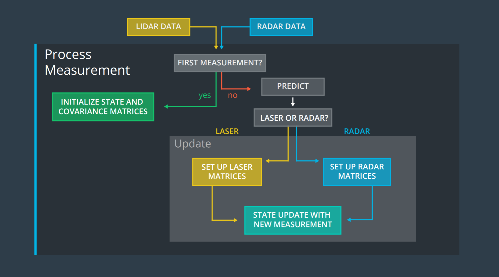
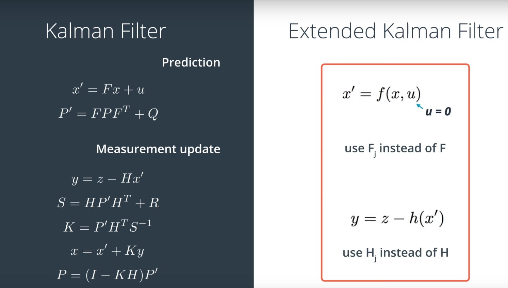

# Extended Kalman Filter Project

# Sensors
---
* Before getting into details of Kalman Filters, let's summarize LASER and Radar sensor characteristics:

#How does LIDAR measurement look like
 *Lidar measurement*

The LIDAR produces 3D measurement px,py,pz. But for the case of driving on the road, we could simplify the position of the tracked object as: px,py. But in real world where you have very steep road, you have to consider z axis as well. Also in application like airplane and drone, you definitely want to consider pz as well.

#How does RADAR measurement look like

 *Radar measurement*

Radar measures position of object in polar coordinates, bearing in radian angle and radial velocity. The position of the object can be estimates as:
px=rho*cos(phi)
py=rho*sin(phi)
such that rho=sqrt(px*px+py*py)
This non-linearity in measured state of radar requires use of extended or unscented kalman filter because resulting state vector are non-gaussian.

 
#Comparison of LIDAR, RADAR and Camera

| Sensor type | LIDAR |	RADAR |	Camera | 
| :---: | :---: | :---: | :---: |
| Resolution | median |	low | high |
| Direct velocity measure |	no |	yes  |	no    |
| All-weather                   |	bad  |	good |	bad   |
| Sensor size                   |	large |	small |	small |
| sense non-line of sight object |	no   |	yes  |	no    |

Note:

* LIDAR wavelength in infrared; RADAR wavelength in mm.
* LIDAR most affected by dirt and small debris.

 *Camera Vs Radar vs Lidar*

# Project Goals
---
The goals / steps in this project are the following:

* Build an Extended Kalman Filter by applying the general processing flow
* Test the Kalman Filter for given measurement (Radar and Laser) and ground truth data
* Calculate RMSE values between estimations and ground truth
* Summarize the results with a written report.

 *Extended Kalman Filter in Action*

# Overview of the Project
---

In this project a kalman filter is used to estimate the state of a moving object of interest with noisy lidar and radar measurements. 

The steps in prediction of state using kalman filter can be seen in image below:
 *Kalman filter estimation flow*

The Kalman Filter algorithm will go through the following steps:

* First measurement - the filter will receive initial measurements of the bicycle's position relative to the car. These measurements will come from a radar or lidar sensor.
* Initialize state and covariance matrices - the filter will initialize the bicycle's position based on the first measurement.
* Then the car will receive another sensor measurement after a time period Δt.
* Predict - the algorithm will predict where the bicycle will be after time Δt. One basic way to predict the bicycle location after Δt is to assume the bicycle's velocity is constant; thus the bicycle will have moved velocity*Δt. In the extended Kalman filter project, we will assume the velocity is constant.
* Update - the filter compares the "predicted" location with what the sensor measurement says. The predicted location and the measured location are combined to give an updated location. The Kalman filter will put more weight on either the predicted location or the measured location depending on the uncertainty of each value.
* Then the car will receive another sensor measurement after a time period Δt. The algorithm then does another predict and update step.

The state of the tracked vehicle (x) considered are: px,py,vx,vy.
Kalman filter estimates state x(k+1) (state at time k+1) and covariance matrix (P).

#  Prediction
---
State Prediction is done according to formula:

x' =F*x+noise

* F is state transition matrix
* noise in this case is process noise which accounts for sudden change in velocity (considered constant here) with zero mean.

State covariance matrix is calculated using following formula:
P′=FPFT + Q

Q is process covariance matrix

# Laser Update
---
For the update step, we use the measurement function to map the state vector into the measurement space of the sensor. Lidar only measures an object's position. But the extended Kalman filter models an object's position and velocity. So multiplying by the measurement function H matrix will drop the velocity information from the state vector x. Then the lidar measurement position and our belief about the object's position can be compared.

z_predicted = H*x 

Laser's state measurements are linear, hence a H matrix (measurement function) is a 2x4 matrix with 0 for values of vx and vy. 
Kalman gain,K, is calculated using covariance matrix with measurement noise added 
and finally state (x) and covariance matrix (P) are updated.

# Radar Update
---
For radar, the measurements are in terms of polar values (ro,theta and ro_dot).There is no H matrix that will map the state vector x into polar coordinates, instead, it is needed to calculate the mapping manually to convert from cartesian coordinates to polar coordinates.

###The resulting h matrix is non-linear. 
Due to non-linearity, the Kalman Filter equations to update the predicted state, X, with new measurements, z doesn't apply because predicted measurement won't be Gaussian anymore. 
In Extended Kalman filter, the non-linear measurement function is expanded using Taylor series and to derive a linear approximation for the h function, expansion upto second term,called Jacobian,is kept. so z_predicted in this case is h(x), calculated as Jacobian of measurement function.
All the other steps remain exactly same as in Laser update step (calculate kalman gain, update state x and cov matrix P).

* Jacobian function is implemented in tool.cpp file 

* It is important to make sure to normalize ϕ in the y vector (z-z_pred) so that its angle is between −π and π

 *Linear vs Extended kalman Filter*

* x is the mean state vector. 
* F is the stae transition matrix.
* u is the external motion vector.
* P is the state covariance matrix, indicating the uncertainty of the object's state.
* Q is the process covariance matrix.
* H is the measurement matrix.
* z is the measurement.
* R is the measurement noise.
* I is the identity matrix.
* K is the Kalman filter gain.
* Hj and Fj are the jacobian matrix.

# Performance of EKF
---
The performance of EKF is derived by calculating root mean square of estimations of px/py/vx/vy against ground truth data provided in the project.
* RMSE function is implemented in tools.cpp file

# Implementation
---

The C-code implementing EKF are in directory src in this repo.

The kalman filter related functions are in file: kalman_filter.h and kalman_filter.cpp

Class KalmanFilter is defined with data members, x_,P_,F_,Q_,H_ and R_. KalmanFilter class also has method members Predict (prediction steps common to Laser and Radar),Update (update step for laser measurement) and UpdateEKF (update step for Radar measurement).

Class FusionEKF (files FusionEKF.h and FusionEKF.cpp)  instantiates KalmanFilter object. It has member method ProcessMeasurement, which initializes state transition matrix and covariance matrix and calls Predict/Update or UpdateEKF methods to predict or update  KalmanFilter object based on type or measurement data (Laser or Radar).

File measurement_package.h define class MeasurementPackage that has data member SensorType and raw_measurements_.

File tools.cpp defines Tools class that has CalculateRMSE and CalculateJacobian as members.

main.cpp file interacts with [simulator](https://github.com/udacity/self-driving-car-sim/releases), calls ProcessMeasurement to estimate x and P values, calculates RMSE and passes them to simulator.

# Results
---
The implemented EKF was run in simulator with both sensors as well as individual sensors. Here are results:

* Estimations when both sensor data used

 

* RMSE value when  both sensor data used
 

* Estimations when only laser data used

 

* RMSE value when  only laser data used
 

* Estimations when only radar data used

 

* RMSE value when  only radar data used
 

As can be seen, radar data is noisier hence estimations of positions wider than ground truth, however, since radar does measure velocity while laser does not RMSE on velocity in radar is lesser than in laser. 

* Combining laser and radar data RMSE on px/py/vx/vy achieved is:

| px_rmse | py_rmse | vx_rmse | vy_rmse|
| :---: | :---: | :---: | :---: |
| 0.0973178 | 0.0854597 | 	0.451267 | 0.439935 | 

 

To compile and run the EKF code, following steps are required:
(Assuming uWebSocketIO is complete)

1. cd build
2. cmake ..
3. make
4. ./ExtendedKF
5. open unity Simulator, choose data and run

The output (state vectors and rmse) of experiments with both sensors and either radar or laser is in directory outputs along with images captured using python code in [utilities repo](https://github.com/udacity/CarND-Mercedes-SF-Utilities)

